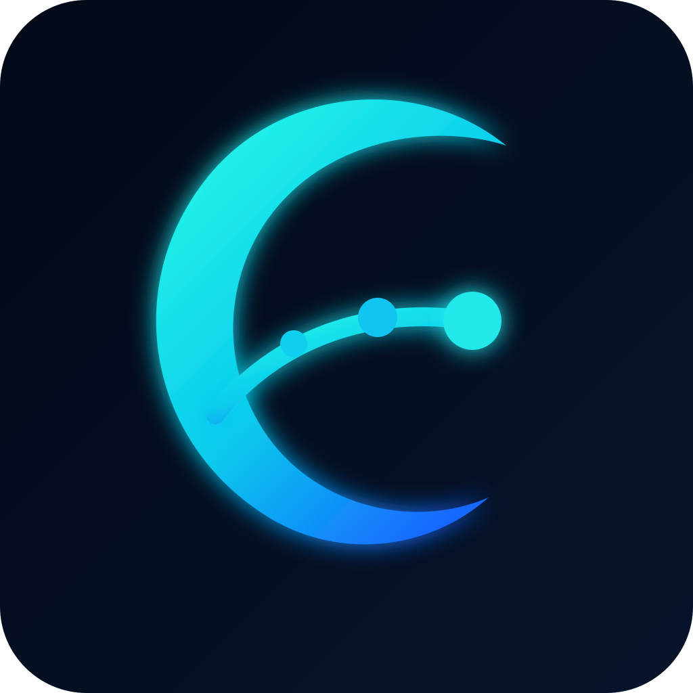

<!----------/qompassai/dotfiles/README.md ---------------->
<!-- ----------Qompass AI Dotfiles ----------------------->
<!-- Copyright (C) 2025 Qompass AI, All rights reserved -->
<!-------------------------------------------------------->


<p align="center">

</p>

<h2> Qompass AI Moonwalk </h2>

<h3 align="center">Veritas in Vestigii</h3>


<p align="center">
  <a href="https://neovim.io/">
    
  </a>
  <a href="https://microsoft.github.io/debug-adapter-protocol/">
    
  </a>
  <a href="https://code.visualstudio.com/">
    
  </a>
  <br>
  <a href="https://www.lua.org/">
    
  </a>
  <a href="https://luajit.org/">
    
  </a>
  <a href="./LICENSE">
    
  </a>
</p>

Moonwalk is a cross-platform Lua debugger and Debug Adapter Protocol server.

It is built for a **native, plugin-free Neovim debugging workflow** while
remaining compatible with Visual Studio Code and other Debug Adapter Protocol
clients.

Moonwalk is not an `nvim-dap` wrapper, and it does not require users to install
a Neovim debugging plugin. The debugger core is editor-independent; Neovim
integration is implemented with native Lua, Neovim APIs, and direct DAP
communication.

> [!NOTE]
> Moonwalk treats Neovim as a first-class debugger client without making
> Neovim-specific plugins a runtime dependency.

<details open>
<summary><strong>▶ Native Neovim configuration</strong></summary>

Moonwalk is configured as the native debugger backend for Lua buffers.

It does not require `nvim-dap`, `nvim-dap-ui`, `mason.nvim`, or another
third-party Neovim debugging plugin. A native DAP registry or direct
`vim.debug`-based client selects Moonwalk when the active buffer has the
`lua` filetype.

Moonwalk registers Lua-specific adapter definitions and configurations:

```lua
-- Conceptual Moonwalk adapter registration.
--
-- Your native DAP loader should load this module once, then activate its
-- configurations only for Lua buffers.

local moonwalk = require("dap.lua")

moonwalk.setup()
```

Moonwalk's Lua adapter provides configurations equivalent to:

```text
Lua: launch current file
Lua: launch selected file
Lua: attach to process
Lua: launch clean headless Neovim
Lua: launch Neovim with the current configuration
```

The exact module path depends on where Moonwalk is installed in your Neovim
runtime path. The important boundary is that the Lua adapter is registered with
your native DAP client, not loaded through a third-party plugin manager.

</details>

<details open>
<summary><strong>▶ Lua buffer mappings</strong></summary>

Moonwalk uses generic debugger commands such as `:DebugRun` and
`:DebugStepInto`, but installs their mappings **only in Lua buffers**.

That means the same debugger key vocabulary can be reused by other native DAP
modules—such as LLDB, Delve, debugpy, GDB, or lldb-dap—without Lua-specific
global mappings.

```lua
-- ~/.config/nvim/lua/dap/lua.lua

local api = vim.api

local function map(bufnr, lhs, command, desc)
  vim.keymap.set("n", lhs, "<Cmd>" .. command .. "<CR>", {
    buffer = bufnr,
    silent = true,
    desc = "Debug: " .. desc,
  })
end

local group = api.nvim_create_augroup("moonwalk.lua-keymaps", {
  clear = true,
})

api.nvim_create_autocmd("FileType", {
  group = group,
  pattern = "lua",
  desc = "Install native Moonwalk mappings for Lua buffers",
  callback = function(event)
    local bufnr = event.buf

    -- Generic debugging lifecycle.
    map(bufnr, "<F5>", "DebugRun", "run or continue")
    map(bufnr, "<F6>", "DebugPause", "pause")
    map(bufnr, "<F7>", "DebugRunLast", "run last configuration")
    map(bufnr, "<F9>", "DebugTerminate", "terminate")
    map(bufnr, "<F8>", "DebugBreakpoint", "toggle breakpoint")

    -- Generic stepping.
    map(bufnr, "<F10>", "DebugStepOver", "step over")
    map(bufnr, "<F11>", "DebugStepInto", "step into")
    map(bufnr, "<F12>", "DebugStepOut", "step out")

    -- Generic breakpoint and inspection operations.
    map(bufnr, "<leader>dB", "DebugBreakpointCondition", "conditional breakpoint")
    map(bufnr, "<leader>db", "DebugBreakpoint", "toggle breakpoint")
    map(bufnr, "<leader>dc", "DebugContinue", "continue")
    map(bufnr, "<leader>dh", "DebugHover", "evaluate expression")
    map(bufnr, "<leader>dl", "DebugLogpoint", "logpoint")
    map(bufnr, "<leader>dp", "DebugPause", "pause")
    map(bufnr, "<leader>dr", "DebugRun", "run")
    map(bufnr, "<leader>dR", "DebugRestart", "restart")
    map(bufnr, "<leader>ds", "DebugScopes", "scopes")
    map(bufnr, "<leader>dt", "DebugTerminate", "terminate")
    map(bufnr, "<leader>de", "DebugRepl", "REPL")
    map(bufnr, "<leader>dq", "DebugStatus", "status")

    -- Lua/Moonwalk-specific controls.
    map(bufnr, "<leader>dmA", "LuaDebugAdapter", "Lua adapter path")
    map(bufnr, "<leader>dmC", "LuaDebugCheck", "Lua environment check")
    map(bufnr, "<leader>dmP", "LuaDebugProcess", "select Lua process")
    map(bufnr, "<leader>dmR", "LuaDebugRuntime", "Lua runtime path")
    map(bufnr, "<leader>dmS", "LuaDebugProcessShow", "selected Lua process")
    map(bufnr, "<leader>dmX", "LuaDebugProcessClear", "clear Lua process")
  end,
})
```

The maps above are buffer-local:

```text
Lua buffer       Moonwalk mappings available
Rust buffer      Moonwalk mappings absent
Python buffer    Moonwalk mappings absent
C/C++ buffer     Moonwalk mappings absent
Markdown buffer  Moonwalk mappings absent
```

A Rust buffer can later install the same `<F5>` through `<F12>` debugger keys
through its LLDB/GDB configuration. A Python buffer can install the same keys
through debugpy. The keybinding interface remains consistent; the active
filetype selects the correct backend.

</details>

<details>
<summary><strong>▶ Command model</strong></summary>

Moonwalk separates generic debugger behavior from Lua-specific discovery and
configuration.

### Generic debugger commands

These commands are intentionally language-neutral:

```text
:DebugRun
:DebugRunLast
:DebugContinue
:DebugPause
:DebugRestart
:DebugStop
:DebugTerminate
:DebugDisconnect
:DebugBreakpoint
:DebugBreakpointCondition
:DebugBreakpointClear
:DebugLogpoint
:DebugStepBack
:DebugStepInto
:DebugStepOut
:DebugStepOver
:DebugHover
:DebugScopes
:DebugRepl
:DebugLoad
:DebugStatus
```

A native DAP registry selects the relevant adapter configuration according to
the active buffer, current project, and selected debug target.

### Lua-specific Moonwalk commands

These commands exist only for Lua/Moonwalk discovery and configuration:

```text
:LuaDebugAdapter
:LuaDebugCheck
:LuaDebugCheckAdapter
:LuaDebugCheckRuntime
:LuaDebugProcess
:LuaDebugProcessClear
:LuaDebugProcessShow
:LuaDebugProgram
:LuaDebugRoot
:LuaDebugRuntime
```

Use the generic commands for normal debugging activity. Use the Lua-specific
commands only to inspect or change Moonwalk's Lua runtime, debug adapter,
selected process, program path, or project root.


```text
┌─────────────────────────────────────────────────────┐
│ Neovim                                              │
│                                                     │
│  Native Lua configuration                           │
│  Native commands and mappings                       │
│  Native signs, extmarks, windows, and buffers       │
│  Native vim.debug or local DAP client implementation│
└───────────────────────┬─────────────────────────────┘
                        │
                        │ Debug Adapter Protocol
                        │
┌───────────────────────▼─────────────────────────────┐
│ Moonwalk                                            │
│                                                     │
│  Lua debugger                                       │
│  Launch and attach support                          │
│  Breakpoints, stepping, scopes, variables           │
│  Expression evaluation and remote debugging         │
└───────────────────────┬─────────────────────────────┘
                        │
                        │ Debug transport
                        │
┌───────────────────────▼─────────────────────────────┐
│ Lua 5.1–5.4 or LuaJIT target                        │
│ Local process, Neovim process, or remote process    │
└─────────────────────────────────────────────────────┘
```

</details>

<details open>
<summary><strong>▶ Features</strong></summary>

- Line breakpoints
- Function breakpoints
- Conditional breakpoints
- Hit-count breakpoints
- Logpoints
- Step over, step in, and step out
- Stack-frame inspection
- Watches
- Expression evaluation
- Scope and variable inspection
- Exception breakpoints
- Remote debugging
- Local process attach
- Windows Subsystem for Linux support
- Launch Lua files directly
- Launch a selected Lua file
- Launch clean headless Neovim instances
- Launch Neovim using an existing configuration
- Attach to Lua or Neovim processes
- Debug Adapter Protocol compatibility for VS Code and other DAP clients

</details>

<details open>
<summary><strong>▶ Requirements</strong></summary>

### Build host

- Git
- A C/C++ toolchain appropriate for the host platform
- [luamake](https://github.com/qompassai/luamake)

### Debug target

- Lua 5.1
- Lua 5.2
- Lua 5.3
- Lua 5.4
- LuaJIT

### Neovim client

Moonwalk requires no Neovim plugin.

Use either:

- Neovim's native DAP support when available.
- Your own local Neovim DAP client/session implementation.
- A direct Debug Adapter Protocol connection implemented in Lua.

Moonwalk does **not** require:

```text
nvim-dap
nvim-dap-ui
nvim-dap-virtual-text
mason.nvim
lazy.nvim
packer.nvim
```

Those projects may be compatible external choices for users who want them, but
they are not part of Moonwalk's required architecture.

### Supported platforms

- Linux
- macOS
- Windows
- Windows Subsystem for Linux
- Android
- NetBSD
- FreeBSD

> [!IMPORTANT]
> Lua 5.5 support must not be advertised until Moonwalk has an implemented,
> tested, and documented compatibility path for it.

</details>

<details open>
<summary><strong>▶ Build</strong></summary>

### 1. Install `luamake`

```bash
git clone --recurse-submodules [https://github.com/qompassai/luamake.git](https://github.com/qompassai/luamake.git)
pushd luamake
```

On Windows with MSVC:

```powershell
.\compile\install.bat
```

On Linux, macOS, and other supported Unix-like systems:

```bash
./compile/install.sh
```

Confirm the installation:

```bash
luamake --version
popd
```

### 2. Clone Moonwalk

```bash
git clone --recurse-submodules [https://github.com/qompassai/moonwalk.git](https://github.com/qompassai/moonwalk.git)
cd moonwalk
```

If cloned without submodules:

```bash
git submodule update --init --recursive
```

### 3. Download build dependencies

```bash
luamake lua compile/download_deps.lua
```

### 4. Build Moonwalk

Development build:

```bash
luamake
```

Release build:

```bash
luamake -mode release
```

</details>

<details open>
<summary><strong>▶ Plugin-free Neovim configuration</strong></summary>

Moonwalk should be registered directly from your Neovim configuration.

The exact implementation depends on the native DAP client layer you maintain,
but Moonwalk's adapter configuration should remain explicit and local:

```lua
-- ~/.config/nvim/lua/debug/moonwalk.lua

local M = {}

M.adapter = {
  type = "executable",
  command = vim.fn.exepath("moonwalk"),
  args = {},
}

M.configurations = {
  {
    name = "Lua: launch current file",
    type = "moonwalk",
    request = "launch",
    program = function()
      return vim.api.nvim_buf_get_name(0)
    end,
    cwd = function()
      local file = vim.api.nvim_buf_get_name(0)

      return vim.fs.root(file, {
        ".git",
        ".luacheckrc",
        ".luarc.json",
        ".luarc.jsonc",
        ".stylua.toml",
        "selene.toml",
      }) or vim.fn.getcwd()
    end,
    stopOnEntry = false,
  },
}

return M
```

Your own native session layer should consume that adapter definition, start the
Moonwalk executable, exchange DAP messages, and render debugging state through
Neovim APIs.

Suggested native commands:

```text
:MoonwalkLaunch
:MoonwalkAttach
:MoonwalkContinue
:MoonwalkPause
:MoonwalkRestart
:MoonwalkStop
:MoonwalkBreakpoint
:MoonwalkBreakpointCondition
:MoonwalkLogpoint
:MoonwalkStepInto
:MoonwalkStepOver
:MoonwalkStepOut
:MoonwalkScopes
:MoonwalkEvaluate
:MoonwalkRepl
:MoonwalkStatus
```

Suggested mappings:

```lua
vim.keymap.set("n", "<F5>", "<Cmd>MoonwalkContinue<CR>", {
  desc = "Moonwalk: launch or continue",
})

vim.keymap.set("n", "<F6>", "<Cmd>MoonwalkPause<CR>", {
  desc = "Moonwalk: pause",
})

vim.keymap.set("n", "<F8>", "<Cmd>MoonwalkBreakpoint<CR>", {
  desc = "Moonwalk: toggle breakpoint",
})

vim.keymap.set("n", "<F10>", "<Cmd>MoonwalkStepOver<CR>", {
  desc = "Moonwalk: step over",
})

vim.keymap.set("n", "<F11>", "<Cmd>MoonwalkStepInto<CR>", {
  desc = "Moonwalk: step into",
})

vim.keymap.set("n", "<F12>", "<Cmd>MoonwalkStepOut<CR>", {
  desc = "Moonwalk: step out",
})
```

</details>

<details>
<summary><strong>▶ Neovim design principles</strong></summary>

Moonwalk follows these Neovim integration rules:

1. **No mandatory plugins.**  
   Core debugging must work from native Lua configuration.

2. **No hidden executable downloads.**  
   The user controls the Moonwalk binary, Lua runtime, and debug target.

3. **No global configuration mutation.**  
   Project roots, interpreter paths, and runtime arguments are resolved
   explicitly and locally.

4. **No fake abstraction over DAP.**  
   Moonwalk exposes normal Debug Adapter Protocol capabilities rather than
   hiding standard launch, attach, breakpoint, scope, stack, and evaluation
   behavior behind proprietary editor-only commands.

5. **Neovim owns the user interface.**  
   Moonwalk does not dictate which windows, signs, extmarks, floating panels,
   keymaps, colors, or layouts a user must adopt.

6. **Project-aware activation.**  
   Lua project roots should be detected from markers such as `.git`,
   `.luacheckrc`, `.luarc.json`, `.stylua.toml`, and `selene.toml`.

</details>

<details>
<summary><strong>▶ Visual Studio Code compatibility</strong></summary>

Moonwalk retains Visual Studio Code compatibility through the Debug Adapter
Protocol.

VS Code is a supported Moonwalk client, but Moonwalk does not require VS Code
to build, launch, attach, or debug Lua programs.

A VS Code integration can package Moonwalk as a standard debugger extension or
use it as an external Debug Adapter Protocol executable.

Example starting point for `.vscode/launch.json`:

```json
{
  "version": "0.2.0",
  "configurations": [
    {
      "type": "lua",
      "request": "launch",
      "name": "Launch Lua program",
      "program": "${workspaceFolder}/main.lua"
    }
  ]
}
```

The final extension identifier, adapter type, request fields, and packaging
layout must match Moonwalk's extension manifest and adapter implementation.

</details>

<details>
<summary><strong>▶ Development</strong></summary>

```bash
git submodule update --init --recursive
luamake lua compile/download_deps.lua
luamake
```

Before opening a pull request:

```bash
git status --short
git diff --check
```

Development requirements:

- Preserve Debug Adapter Protocol compatibility.
- Keep the debugger core independent from editor UI code.
- Keep Neovim integration compatible with direct native Lua configuration.
- Do not introduce a mandatory plugin dependency.
- Add regression coverage for supported Lua versions.
- Add regression coverage for launch, attach, breakpoints, stepping, scopes,
  variables, expression evaluation, and remote debugging.
- Do not commit generated output, credentials, local editor state, or debug
  logs unless explicitly intended as release artifacts.

</details>

<details>
<summary><strong>▶ Upstream</strong></summary>

Moonwalk is derived from
[actboy168/lua-debug](https://github.com/actboy168/lua-debug).

Thank you to [@actboy168](https://github.com/actboy168) and all upstream
contributors for the original Lua Debug Adapter implementation.

Moonwalk preserves required attribution and license notices for upstream-derived
code.

</details>

<details>
<summary><strong>▶ License</strong></summary>

Moonwalk is distributed under the
[Apache License, Version 2.0](./LICENSE).

If this repository retains or modifies upstream `lua-debug` code, preserve the
relevant upstream copyright and MIT notices in `NOTICE` and/or affected source
files.

</details>
